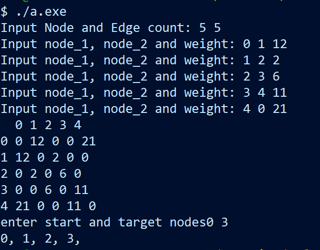
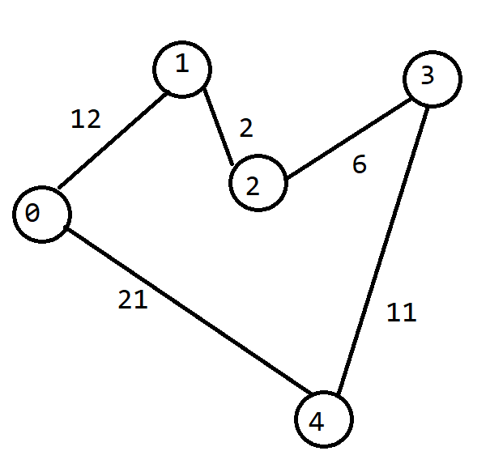

# A star algorithm implentation in C++

## Setup and get started

### Setup

- clone the repository
`git clone https://github.com/razachikyan/diploma.git`

- open the project directory
`cd ./diploma`

- build the project
`g++ ./main.cpp ./Graph/Graph.cpp`

### Get started

- run the app
`./a.exe`

- Input the graph step by step in consloe

